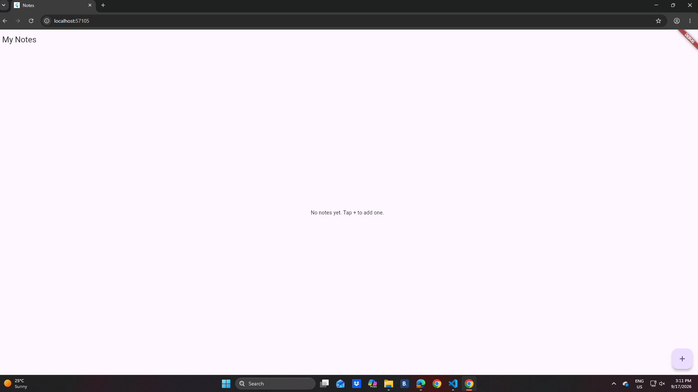
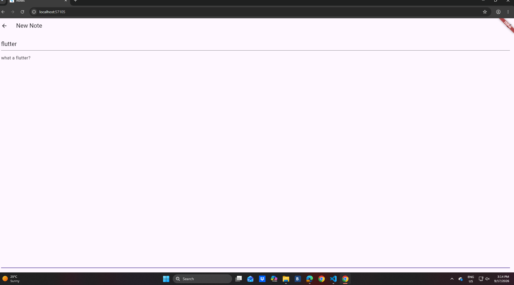
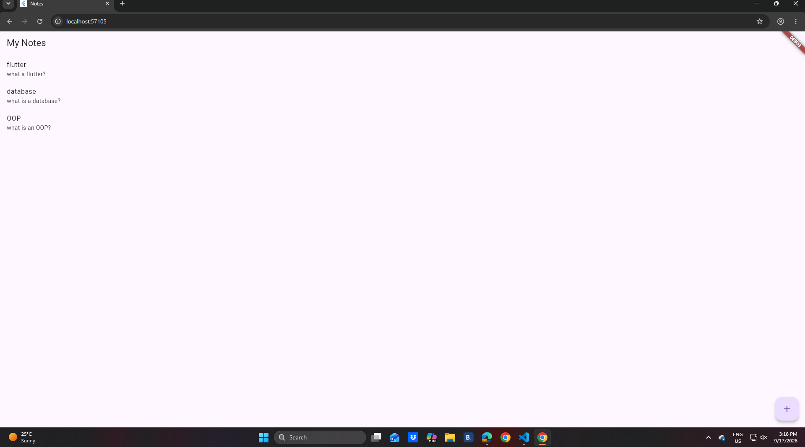

# Notes App

A simple, clean note-taking app built with Flutter. Create, edit, and delete notes, with everything saved locally so your notes are still there the next time you open the app.

## Features

- **Create notes** with a title and body
- **Edit existing notes** by tapping on them
- **Delete notes** with a swipe gesture
- **Local persistence** — notes are saved on-device using `shared_preferences` and survive app restarts
- Simple, friendly empty state when you have no notes yet

## Built With

- [Flutter](https://flutter.dev/) & [Dart](https://dart.dev/)
- [shared_preferences](https://pub.dev/packages/shared_preferences) for local storage

## Getting Started

1. Make sure you have the [Flutter SDK](https://docs.flutter.dev/get-started/install) installed.
2. Clone this repository:
   ```
   git clone https://github.com/Thabang-bit/notes_app.git
   cd notes_app
   ```
3. Install dependencies:
   ```
   flutter pub get
   ```
4. Run the app:
   ```
   flutter run
   ```

## Screenshots

| Empty State | Note Editor | Notes List |
|---|---|---|
|  |  |  |

## What I Learned

Building this project helped me practice core Flutter concepts including:
- Widget composition and `StatefulWidget` / `StatelessWidget`
- Navigation between screens with `Navigator.push` and returning data with `Navigator.pop`
- Managing local app state with `setState`
- Persisting structured data locally by serializing to/from JSON with `shared_preferences`
- Handling user gestures with `Dismissible` for swipe-to-delete

## Possible Future Improvements

- Search/filter notes
- Note categories or tags
- Switch to `sqflite` for more scalable local storage
